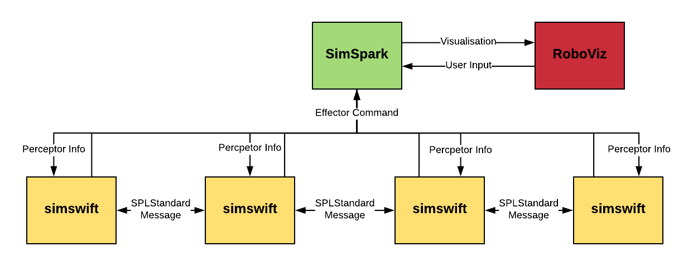

#############
3D Simulation
#############

********
Overview
********

3D Simulation can be used for developing 
    - Behaviours
    - Motion
    - Localisation
    - Support Tools

It cannot be used for developing
    - Vision

********************
How It Works
********************

Overall
=======

3D Simulation consists of
    - `rcssserver3d`_
    - `simswift`_
    - `RoboViz`_

rcssserver3d
============

3D soccer simulation server running on top of simspark
simulation system. Developed by the RoboCup 3D Simulation League.
rUNSWift modifications are made in `rUNSWift's fork <https://gitlab.com/ijnek/SimSpark>`__.
More information can be found at `Simspark Wiki <https://gitlab.com/robocup-sim/SimSpark/wikis/home>`__.

simswift
========

simswift is the rUNSWift build target on a Linux PC, and is the agent that connects to the simulation server.
Refer to `Collette's (2017)
thesis <../blob/master/docs/Collette-Using_3D_Simulation_to_Develop_Robot_Code/Collette-Using_3D_Simulation_to_Develop_Robot_Code.pdf>`__
for more info.

RoboViz
=======

User-friendly visualiser for the simulator.
Provides a graphical interface to interact with the simulator, such as moving the ball and robots.
rUNSWift modifications are made in `rUNSWift's fork <https://github.com/ijnek/RoboViz>`__.
More information can be found at `magmaOffenburg/RoboViz Github <https://github.com/magmaOffenburg/RoboViz>`__.

Recompiling after changes in the simulator
==========================================

-  To re-compile SimSpark, run ``spark_build`` from anywhere, this
   script can be found in ``simspark/bin/``
-  To re-compile rcssserver3d, run ``rcs_build`` from anywhere, this
   script can be found in ``simspark/bin/``

Contributing to the 3D-Simulation Software
==========================================

Making changes to SimSpark / RCSS
---------------------------------

1. Gain Access to Project from https://gitlab.com/ijnek/SimSpark
2. Push commits on a branch, create merge request.
3. Notify `maintainer <#contact--maintainer>`__ of repository to merge
   branch into master.

Making changes to Roboviz
-------------------------

1. Gain Access to Project from https://github.com/ijnek/RoboViz
2. Push commits on a branch, create pull request.
3. Notify `maintainer <#contact--maintainer>`__ of repository to merge
   branch into master.

rUNSWift Modification List
==========================

This is a list of what rUNSWift has modified in the SimSpark and
RoboViz. This list should be kept up to date so we know what to preserve
when incorporating changes made in the original open-source projects.

SimSpark / RCSS Modifications
-----------------------------

100FPS
~~~~~~

-  To match the speed of the motion of the SoftBank NAO V5, the
   simulator's FPS was changed from 50FPS to 100FPS.

SPARK\_FAST\_TIME
~~~~~~~~~~~~~~~~~

-  This is an environment variable that was added to affect multiple
   settings to allow speed-ups in the simulator

rcssserver3d/bin
~~~~~~~~~~~~~~~~

-  ``rcs_build`` and ``spark_build`` scripts were added in
   ``rcssserver3d/bin`` for easy compiling of the simulator.

Disabling Autoref
~~~~~~~~~~~~~~~~~

-  Autoreffing has been disabled, as it is not needed.

FieldFeatures
~~~~~~~~~~~~~

-  A significant modification rUNSWift has made to rcssserver3d, is the
   addition of "FieldFeatures" (corners, t-junctions, centre circles,
   etc).
-  This is a modification to allow the "orientation" of a fieldfeature
   to be recognised (such as a corner) by the agent in the simulator
-  To view the list of fieldfeatures refer to
   ``simspark/rcssserver3d/data/rsg/agent/nao/soccer.rsg``

RoboViz Modifications
---------------------

Goal and Penalty Box Size
~~~~~~~~~~~~~~~~~~~~~~~~~

-  Goal and Penalty Box Size were modified to meet SPL requirements

Known issues
============

-  rcssserver3d will sometimes crash, and keep running in the
   background. This can happen especially if you disconnect/connect
   agents very quickly. When this happens, run the following command:
   ``pkill -9 rcssserver3d; rcssserver3d``
-  Some movements such as the getup have not been tuned in the
   simulator.

FAQ
===

Contact / Maintainer
====================

| For more information, contact
| \* ijnek - kenjibrameld@gmail.com
