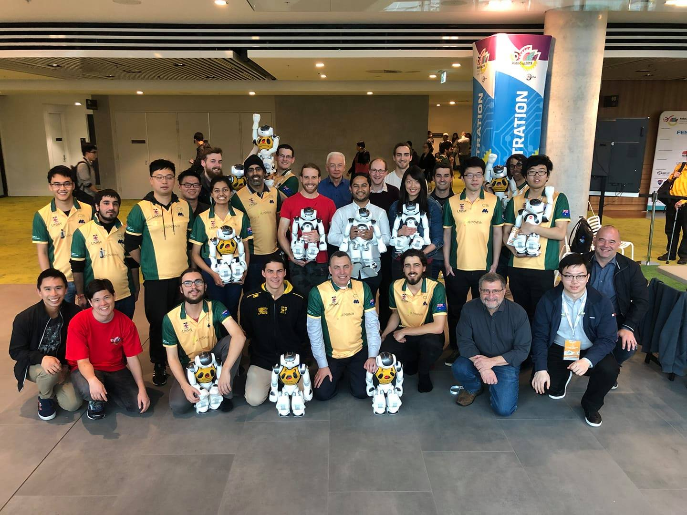

.. doctut documentation master file, created by
   sphinx-quickstart on Sun Aug 25 19:41:04 2019.
   You can adapt this file completely to your liking, but it should at least
   contain the root `toctree` directive.

Welcome to rUNSWift's Documentation!
====================================

rUNSWift is a team from the University of New South Wales that competes in the `Standard Platform League <https://spl.robocup.org/>`_ of RoboCup.

.. toctree::
   :hidden:
   :maxdepth: 1

   setup/index
   architecture
   perception/index
   motion/index
   networking
   3d_simulation
   logs
   tools/index
   style_guide
   contributing/index
   past_research
   code_releases_team_reports
   joining_runswift
   contact
