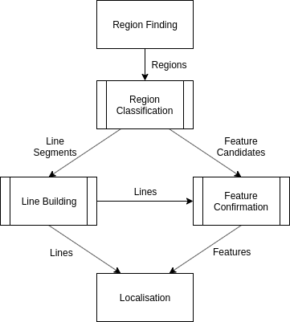

######################
Field Feature Detector
######################

The new field feature detector takes advantage of the ability of the ROI system to
locate line segments. All lines of the field are white, such that they are detected
and segmented by the Connected Component Analysis. Some computationally efficient checks
are performed on each region, allowing us to determine whether it contains a
field feature. This is more efficient than the previous approach, which scanned
the frame for candidate points and ran RANSAC on these points to locate field features. The new detector is compatible with the binarisation of vision as it
considers the light pixels as white (for lines) and dark pixels as green (for the
field).

Our system detects regions that appear to contain line segments, corners,
T-intersections and curved line segments. Curved line segments are combined
together to form centre circle candidates, which are further checked for a line
passing through the middle of the candidate circle to provide confirmation and
orientation. If line segments intersect near the detected corner and T-intersection
features these features can be confirmed, or even new, possibly occluded, ones
detected. These lines and more distinct field features are passed to localisation
to determine the position of the robot.

**The system is outlined below.**

**More details can be found in the** `Team Report 2018 <http://cgi.cse.unsw.edu.au/~robocup/2018/TeamPaper2018.pdf>`_.
