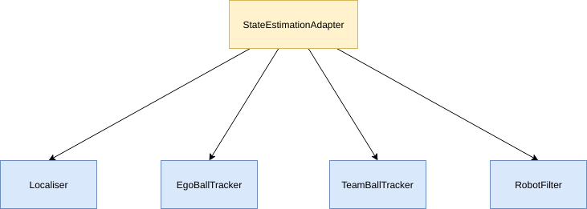

################
State Estimation
################

************
Architecture
************

State Estimation is structured in a way to allow off-board testing, since testing state estimation on-board the NAO is almost impossible. Off-board testing can be achieved by recording all the data from the blackboard that is required by the State Estimation Module, on the NAO while running,then copying this to your computer and feeding it through a state estimation simulator system off-board. For this structure, it is important that only StateEstimationAdapter can read to / write from the blackboard.

The State Estimation module is also written in such a way to allow easy additions/deletions/replacements of submodules, so future members can simply rewrite Estimators without being scared of breaking existing stuff!

**A message to future rUNSWift members from Kenji: Don't add hacks to state estimation, it will bite you back!** :imp::imp::imp:

*********************
EstimatorInfo Classes 
*********************

There are four classes,
* EstimatorInfoInit - (init:Initialisation)
* EstimatorInfoIn
* EstimatorInfoMiddle
* EstimatorInfoOut

These classes **simplify the passing of data between estimators a lot**, rather than passing one or two variables down to the various estimators, a reference to this class can be passed down. The benefit is, lets say you want access to a variable in `MultiModalCMKF.cpp` from blackboard that you don't have access to currently. Without this class, you will have to modify `StateEstimationAdapter`, `Localiser` and `MultiModalCMKF`. With this class, all you have to do is add the variable as a member of `EstimatorInfoIn`. Another major benefit is that we can serialize `EstimatorInfoInit` during initialisation and `EstimatorInfoIn` during every tick, to a file and save it on the robot while running. Later, we can run the same data through an offline simulator for testing. This would be a lot more annoying if we were passing direct variables down, or if every Estimator had direct access to the blackboard.

EstimatorInfoInit
=================

This is an Initialiser object, and a reference is passed down to all Estimators, (and used in the constructor). The instance exists throughout runtime in StateEstimationAdapter object. It stores information that doesn't change during run time, such as the player number of the robot.

EstimatorInfoIn
===============
This is an object containing information specific to that frame. A reference is passed down to the Estimators. It is a `const`, and hence read-only.

EstimatorInfoMiddle
===================

This object is constructed in StateEstimationAdapter, and is used for passing information between Estimators. The object only exists for a frame and is destructed after the frame.

EstimatorInfoOut
================

This object is constructed at the start of `tick` in StateEstimationAdapter, and filled out by the different estimators, where appropriate. It is returned to `StateEstimationAdapter`, which then writes the variables to blackboard.

.. toctree::
   :maxdepth: 1

   localiser
   ego_ball_tracker
   team_ball_tracker
   robot_filter
