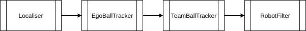

################
State Estimation
################

************
Introduction
************

State Estimation's purpose is to estimate the position and velocity of the robot, ball and other robots on the field.

************
Architecture
************

State Estimation is structured in a way to allow off-board testing, since testing state estimation on-board the NAO is almost impossible. Off-board testing can be achieved by recording all the data from the blackboard that is required by the State Estimation Module, on the NAO while running,then copying this to your computer and feeding it through a state estimation simulator system off-board. For this structure, it is important that only StateEstimationAdapter can read to / write from the blackboard.

The State Estimation module is also written in such a way to allow easy additions/deletions/replacements of submodules, so future members can simply rewrite Estimators without being scared of breaking existing stuff!

*********************
EstimatorInfo Objects 
*********************

Estimator Information objects simplify the logging of input data and passing of data between the estimators. The estimatorInfo objects are created in :code:`StateEstimationAdapter`, and passed by reference to the estimators.

EstimatorInfoInit
=================

Object storing information that is known when runswift starts, that doesn't change during execution.
(eg. Team Number, Player Number, Initial Robot Position)

Object is constructed upon program execution and destructed when the program is killed.

EstimatorInfoIn
===============

Object storing information that is used in state estimation that changes throughout execution.
(eg. Field Features, Ball Updates, Odometry, Penalty State)

Object is constructed and destructed in StateEstimationAdapter every frame.

EstimatorInfoMiddle
===================

Object storing information that is passed between estimators, but not going to be written to the blackboard.

Object is constructed and destructed in StateEstimationAdapter every frame.

EstimatorInfoOut
================

Object storing information that is going to be written back to the blackboard by :code:`StateEstimationAdapter`.

Object is constructed and destructed in StateEstimationAdapter every frame.

********************
Developing / Testing
********************
State Estimation is difficult to test and replicate, as what happens in a single tick depends on the previous state, which then depends on it's previous state, etc....

Development can be achieved by recording the input data into state estimation in the simulator, or on the actual NAO.

.. note::
   Testing state estimation on-board the actual NAO is impossible as you can never replicate the same case when something goes wrong. Always record input data and run it through simulation for debugging.

Logging State Estimation Input
==============================

To log estimatorInfoInit and estimatorInfoIn, 
   1. Enable logging by setting :code:`save_estimator_objects_to_file=TRUE` under :code:`stateestimation` in :code:`runswift.cfg`.
   2. (Optional: Change file name by the :code:`estimator_objects_file_name` option under :code:`stateestimation` options in :code:`runswift.cfg`. (eg. :code:`estimator_objects_file_name=test.txt`). Default is :code:`estimator_objects_record.txt`.

Running State Estimation Simulator
==================================

To run the state estimation simulator,
   1. Compile the state estimation simulator by running :code:`nao_build-2.8.sh state-estimation-simulator.bin`.
   2. Run the simulator :code:`state-estimation-simulator-2.8.sh <path/to/file>`.
      (eg. :code:`state-estimation-simulator-2.8.sh logs/record.txt`)

.. warning::
   Don't add hacks to state estimation. It is very easy to break it and hard to fix!

**********
Estimators
**********

There are currently four estimators. 

.. toctree::
   :maxdepth: 1

   localiser
   ego_ball_tracker
   team_ball_tracker
   robot_filter